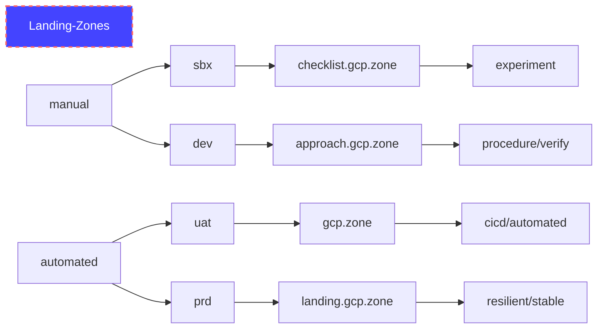

# Landing Zones for GCP
Landing zone concepts have a lot in common with aeronautical concepts.  As the automatation/autopilot level increases the restrictions on the pilot reduce and vice versa to VFR where the pilot is unrestricted
- Approach - https://www.faa.gov/regulations_policies/handbooks_manuals/aviation/airplane_handbook/media/10_afh_ch8.pdf
- ATC - Air Traffic Control
- CA - Controled Airspace
- Crosswinds = hacking, DDoS, 
- GC - Ground Control
- IFR - Instrument Flight Rules (fly with only instruments - IE at night in a cloud during landing) - restricted
- ILS - [Instrument Landing System](https://en.wikipedia.org/wiki/Instrument_landing_system) (Land using ADF equipment to process signals from multi-frequency directional radio systems on the side of the runway)
- Squak - 4 digit transponder code = label/tag
- VFR - Visual Flight Rules (fly in good weather using your human senses) - unrestricted (less ATC)

# GCP Onboarding Plan
Use the following guide - https://github.com/GoogleCloudPlatform/pbmm-on-gcp-onboarding/blob/main/docs/google-cloud-onboarding.md
We will use the following organizations:

## Manual Landing Zone Flight Plan

## Automated Landing Zone Flight Plan
