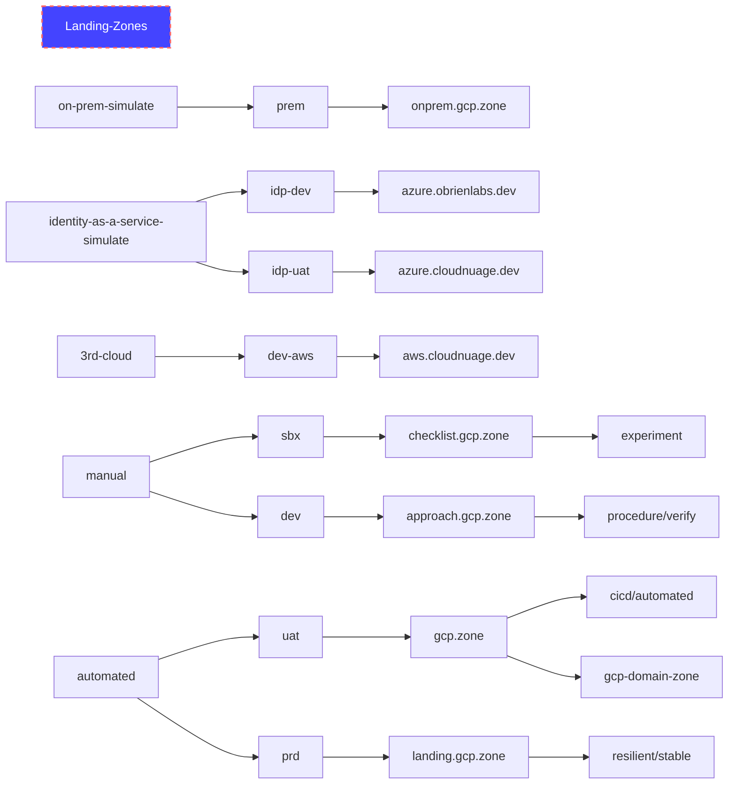

# Landing Zones for GCP
Landing zone concepts have a lot in common with aeronautical concepts.  As the automatation/autopilot level increases the restrictions on the pilot reduce and vice versa to VFR where the pilot is unrestricted
- Approach - https://www.faa.gov/regulations_policies/handbooks_manuals/aviation/airplane_handbook/media/10_afh_ch8.pdf
- ATC - Air Traffic Control
- CA - Controled Airspace
- Crosswinds = hacking, DDoS, 
- GC - Ground Control
- IFR - Instrument Flight Rules (fly with only instruments - IE at night in a cloud during landing) - restricted
- ILS - [Instrument Landing System](https://en.wikipedia.org/wiki/Instrument_landing_system) (Land using ADF equipment to process signals from multi-frequency directional radio systems on the side of the runway)
- Squak - 4 digit transponder code = label/tag
- VFR - Visual Flight Rules (fly in good weather using your human senses) - unrestricted (less ATC)

# GCP Onboarding Plan
Use the following guide - https://github.com/GoogleCloudPlatform/pbmm-on-gcp-onboarding/blob/main/docs/google-cloud-onboarding.md
We will use the following organizations:




## Automated Landing Zone Flight Plan


### Incremental Asset Inventory


## Manual Landing Zone Flight Plan

### Create new Google Cloud Identity Account with Domain/Organization and Billing
#### Open an incognito Chrome window


#### Navigate to Google Cloud Identity Free Account Creation

follow https://cloud.google.com/identity/docs/set-up-cloud-identity-admin and select Cloud Identity Free https://workspace.google.com/signup/gcpidentity/welcome#0


#### Select single business user


#### Use same business name as subdomain - approach.gcp.zone


#### Use base email from the hosting domain - gcp.zone


#### Select name for the super admin


#### Select username for the super admin


#### Create Google Account


#### Goto Setup
There is a very small chance your account will get flagged.


#### Use a phone for requested MFA


#### Domain verification in admin.google.com


#### Switch to hosting account - gcp.zone


#### Apply TXT record


#### Check dig domain txt


#### Return to verify domain


#### 2 min - Setup GCP Cloud Console Now


#### Optionally - Move Billing Accounts or Projects


#### Non-Government - Activate Credits - to enter Billing CC
Periodically you may incur a 48h wait when using the same billing info.


#### Create new Chrome window and Profile


#### Navigate to IAM - check organization

https://console.cloud.google.com/iam-admin/iam?organizationId=431498985862


#### Check billing

https://console.cloud.google.com/billing?organizationId=431498985862


30 min for a verify check this time


#### Switch/Enable billing on default project


#### Activate to enable all services


#### Activate shell.cloud.google.com


#### Increase Project Quotas

https://support.google.com/code/contact/billing_quota_increase


### Add IAM Role Permissions - under organization
- folder admin  
- project billing manager = roles/billing.projectManager
- storage admin
- logging admin
- security admin
- Service Account Token Creator (for Terraform service accounts)


- Service Account Admin
- Folder Creator = roles/resourcemanager.folderCreator
- Organization Policy Admin roles/orgpolicy.policyAdmin

### Create Folder structure
org
- landingzone
- - 


### Create projects
- lz-agz-stg under landingzone folder


## Organization Policies
- set IAM role organization policy admin
- 
### constraints/compute.skipDefaultNetworkCreation = true

### constraints/compute.disableSerialPortAccess = true

### constraints/gcp.resourceLocations = list ["northamerica-northeast1", "northamerica-northeast2"]

https://cloud.google.com/resource-manager/docs/organization-policy/defining-locations


```
michael@cloudshell:~$ gcloud beta resource-manager org-policies set-policy --organization 962342543445 policy.yaml
constraint: constraints/gcp.resourceLocations
etag: CMe_i5gGEKDVkL8D
listPolicy:
  allowedValues:
  - in:northamerica-northeast2-locations
  - in:northamerica-northeast1-locations
updateTime: '2022-08-22T01:45:43.937700Z'
```

## Projects

## IAM Roles
### Super Admin User
#### org level cloudasset.assets.searchAllResources for Cloud Asset Inventory


# Links
- Request more users than 50 or 100 (workspaces) https://cloud.google.com/identity/pricing
