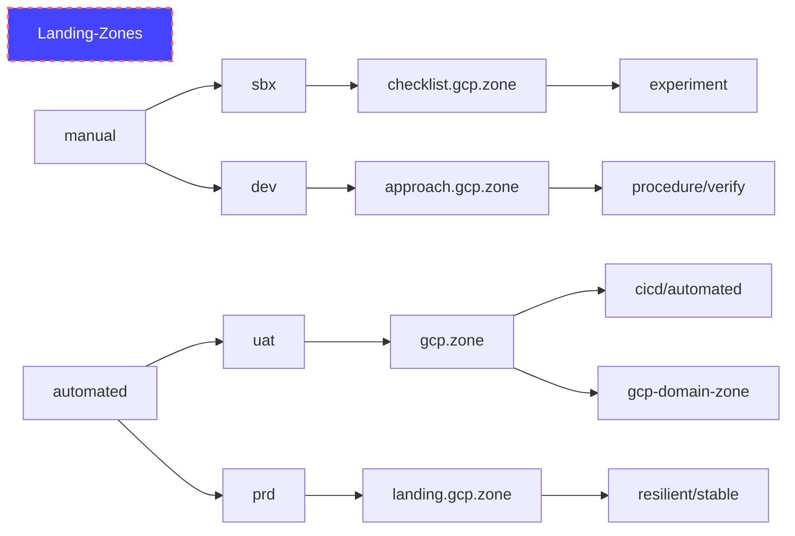

# Landing Zones for GCP
Landing zone concepts have a lot in common with aeronautical concepts.  As the automatation/autopilot level increases the restrictions on the pilot reduce and vice versa to VFR where the pilot is unrestricted
- Approach - https://www.faa.gov/regulations_policies/handbooks_manuals/aviation/airplane_handbook/media/10_afh_ch8.pdf
- ATC - Air Traffic Control
- CA - Controled Airspace
- Crosswinds = hacking, DDoS, 
- GC - Ground Control
- IFR - Instrument Flight Rules (fly with only instruments - IE at night in a cloud during landing) - restricted
- ILS - [Instrument Landing System](https://en.wikipedia.org/wiki/Instrument_landing_system) (Land using ADF equipment to process signals from multi-frequency directional radio systems on the side of the runway)
- Squak - 4 digit transponder code = label/tag
- VFR - Visual Flight Rules (fly in good weather using your human senses) - unrestricted (less ATC)

# GCP Onboarding Plan
Use the following guide - https://github.com/GoogleCloudPlatform/pbmm-on-gcp-onboarding/blob/main/docs/google-cloud-onboarding.md
We will use the following organizations:

## Manual Landing Zone Flight Plan

### Create new Google Cloud Identity Account with Domain/Organization and Billing
#### Open an incognito Chrome window
#### Navigate to Google Cloud Identity Free Account Creation

follow https://cloud.google.com/identity/docs/set-up-cloud-identity-admin and select Cloud Identity Free https://workspace.google.com/signup/gcpidentity/welcome#0

#### Select single business user

#### Use same business name as subdomain - approach.gcp.zone

#### Use base email from the hosting domain - gcp.zone

#### Select name for the super admin

#### Select username for the super admin

#### Create Google Account

#### Goto Setup
There is a very small chance your account will get flagged.

#### Use a phone for requested MFA

#### Domain verification in admin.google.com

#### Switch to hosting account - gcp.zone

#### Apply TXT record

#### Check dig domain txt

#### Return to verify domain

#### 2 min - Setup GCP Cloud Console Now

#### Optionally - Move Billing Accounts or Projects

#### Non-Government - Activate Credits - to enter Billing CC
Periodically you may incur a 48h wait when using the same billing info.

#### Create new Chrome window and Profile

#### Navigate to IAM - check organization

https://console.cloud.google.com/iam-admin/iam?organizationId=431498985862

#### Check billing

https://console.cloud.google.com/billing?organizationId=431498985862

30 min for a verify check this time

#### Switch/Enable billing on default project

#### Activate to enable all services

#### Activate shell.cloud.google.com

#### Increase Project Quotas

https://support.google.com/code/contact/billing_quota_increase

## Automated Landing Zone Flight Plan

# Links
- Request more users than 50 or 100 (workspaces) https://cloud.google.com/identity/pricing
